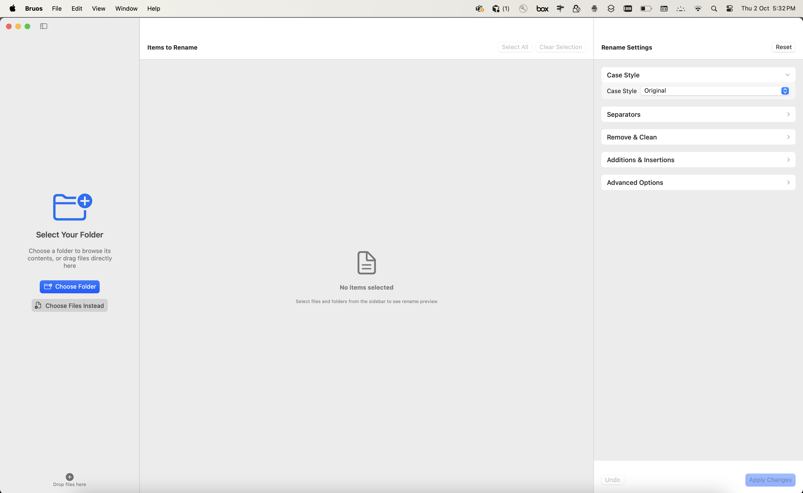
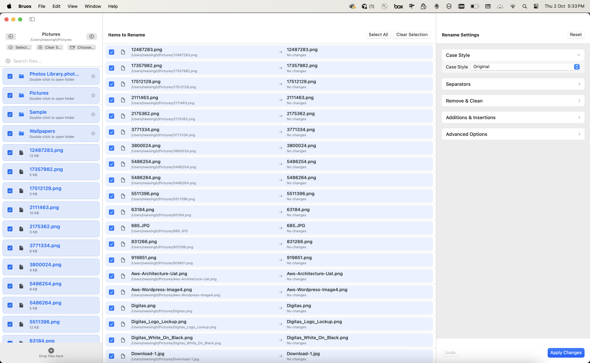

# Bruos - macOS Bulk Rename App

[](https://swift.org)
[](https://www.apple.com/macos/)
[](https://developer.apple.com/xcode/)
[](LICENSE)
[](https://github.com/noncent/bruos)
[](https://github.com/noncent/bruos/releases)

> A modern, native macOS application for bulk file renaming with an intuitive 3-pane interface. Built with SwiftUI for a native macOS experience.


## 🚀 Quick Download

**[Download Bruos v1.0](https://github.com/noncent/bruos/releases/latest)** - Ready-to-use macOS app

*Requires macOS 13.0+ | Apple Silicon (ARM64) or Intel Mac*

## 📸 Screenshots

### 🏠 Main Interface

*The main 3-pane interface showing file explorer (left), file list with preview (center), and rename settings (right)*

### ⚙️ Working with Files

*File selection and rename configuration in action - demonstrating the real-time preview functionality*

### 🎯 Key Features Shown
- **Left Panel**: File explorer with folder navigation
- **Center Panel**: File list with checkboxes and preview
- **Right Panel**: Comprehensive rename settings and options
- **Real-time Preview**: See changes before applying
- **Professional UI**: Clean, modern macOS design

## ✨ What's New in v1.0

- 🎨 **Custom App Icons**: Beautiful PNG icons integrated for all macOS icon sizes
- 🆘 **Help Menu**: Custom Help menu with "About Bruos" option
- ℹ️ **About Dialog**: Professional About popup with creator information and FOSS declaration
- 🎯 **Enhanced UI**: Improved padding and spacing for better visual hierarchy
- ⚡ **Release Build**: Optimized and code-signed for smooth operation
- 📦 **Ready to Use**: Download and run immediately

## Features

### 🎯 Core Functionality
- **3-Pane Layout**: File explorer, file list with preview, and rename settings
- **Real-time Preview**: See changes before applying them
- **Drag & Drop**: Easy file import from Finder
- **Multiple Rename Options**: Case styles, separators, additions, and advanced regex

### 📁 File Management
- **Finder-style Navigation**: Browse directories with familiar interface
- **File Selection**: Checkbox-based file selection
- **Search**: Quick file search within current directory
- **File Information**: Display file size, modification date, and path

### 🔧 Rename Options

#### Case Styles
- UPPERCASE, lowercase, Capitalize Words
- camelCase, PascalCase
- snake_case, kebab-case, dot.separated
- Snake_Case, Kebab-Case, Dot.Separated

#### Separators
- Replace spaces with: Space, Underscore, Hyphen, Dot
- Merge duplicate separators option

#### Remove & Clean
- Remove numbers, spaces, special characters
- Trim leading/trailing characters (configurable count)

#### Additions & Insertions
- Prefix and suffix text
- Auto-numbering: 01, 001, (1), -1
- Date/Time insertion: Created, Modified, Current
- Custom date format support

#### Advanced Options
- Regex find and replace
- Recursive renaming (subfolders)
- Conflict resolution: Skip, Overwrite, Auto-rename

### 🎨 User Experience
- **Native macOS Design**: Built with SwiftUI for modern, native feel
- **Custom App Icons**: Professional PNG icons for all macOS icon sizes
- **Help Menu Integration**: Custom Help menu with About dialog
- **Dark/Light Mode**: Automatic system preference adaptation
- **Smooth Animations**: Expandable settings sections
- **Professional About Dialog**: Creator information and FOSS declaration
- **Undo/Redo**: Full undo/redo support (planned)
- **Profiles/Presets**: Save and load rename configurations (planned)

## Technical Details

### Architecture
- **SwiftUI**: Modern declarative UI framework
- **MVVM Pattern**: Clean separation of concerns
- **ObservableObject**: Reactive data binding
- **File System Integration**: Native file operations

### File Structure
```
Bruos/
├── BruosApp.swift              # Main app entry point with About dialog
├── ContentView.swift           # Main 3-pane layout
├── Models/
│   ├── FileItem.swift          # File representation model
│   └── RenameSettings.swift    # Rename configuration model
├── ViewModels/
│   └── FileManager.swift       # File system operations
├── Views/
│   ├── FileExplorerView.swift  # Left sidebar file browser
│   ├── FileListView.swift      # Main file list with preview
│   └── RenameSettingsView.swift # Right panel settings
├── Utils/
│   └── RenameEngine.swift      # Core rename logic
├── Assets.xcassets/
│   └── AppIcon.appiconset/     # Custom PNG app icons
└── public/
    └── icons/                  # Source PNG icon files
```

### Requirements
- **macOS**: 13.0 or later
- **Xcode**: 15.0 or later
- **Swift**: 5.0 or later

## 📥 Installation

### 🚀 Quick Install (Recommended)
1. **[Download the latest release](https://github.com/noncent/bruos/releases/latest)**
2. Extract `Bruos-v1.0-Release.zip`
3. Move `Bruos.app` to your Applications folder
4. Launch the app (right-click → "Open" on first launch)

### 🔧 Build from Source
1. Clone the repository:
   ```bash
   git clone https://github.com/noncent/bruos.git
   cd bruos
   ```
2. Open `Bruos.xcodeproj` in Xcode
3. Build and run the project (⌘+R)

### 📋 Requirements
- **macOS**: 13.0 or later
- **Architecture**: Apple Silicon (ARM64) or Intel Mac
- **For Development**: Xcode 15.0+, Swift 5.0+

### 🎯 Quick Start Guide
1. **Launch** the app
2. **Navigate** to your desired folder using the left sidebar
3. **Select files** you want to rename (checkboxes)
4. **Configure settings** in the right panel
5. **Preview changes** in the main panel
6. **Apply changes** to rename files

## 📖 Usage

### 🎯 Basic Workflow
1. **Open the app** - Starts in Documents directory
2. **Navigate** - Use the left sidebar to browse folders
3. **Select files** - Check files you want to rename
4. **Configure settings** - Use the right panel to set rename rules
5. **Preview changes** - See real-time preview in the main panel
6. **Apply changes** - Click "Apply Changes" to rename files

### ⚡ Advanced Features
- **🖱️ Drag & Drop**: Drag files from Finder into the app
- **🔍 Search**: Use the search bar to quickly find files
- **🔧 Regex**: Use advanced regex patterns for complex renaming
- **🆘 Help Menu**: Access "About Bruos" from the Help menu
- **ℹ️ About Dialog**: View app information, creator details, and FOSS declaration
- **💾 Profiles**: Save and reuse rename configurations (coming soon)

### 🎨 Rename Examples

#### 📸 Photo Organization
| Original | Pattern | Result |
|----------|---------|--------|
| `IMG_001.jpg` | Add prefix "Vacation_" | `Vacation_IMG_001.jpg` |
| `IMG_002.jpg` | Add prefix "Vacation_" | `Vacation_IMG_002.jpg` |
| `IMG_003.jpg` | Add prefix "Vacation_" | `Vacation_IMG_003.jpg` |
| `photo1.jpg` | Add counter | `photo_001.jpg` |
| `photo2.jpg` | Add counter | `photo_002.jpg` |
| `photo3.jpg` | Add counter | `photo_003.jpg` |

#### 📄 Document Cleanup
| Original | Pattern | Result |
|----------|---------|--------|
| `my file name.txt` | Snake case | `my_file_name.txt` |
| `My Document.pdf` | Snake case | `my_document.pdf` |
| `Report 2024.docx` | Snake case | `report_2024.docx` |
| `Document (1).pdf` | Remove numbers | `Document ().pdf` |
| `Document (2).pdf` | Remove numbers | `Document ().pdf` |
| `Document (3).pdf` | Remove numbers | `Document ().pdf` |

#### 🔧 Case Transformations
| Original | Pattern | Result |
|----------|---------|--------|
| `my file name.txt` | UPPERCASE | `MY FILE NAME.TXT` |
| `MY FILE NAME.TXT` | lowercase | `my file name.txt` |
| `my file name.txt` | Capitalize Words | `My File Name.txt` |
| `my file name.txt` | camelCase | `myFileName.txt` |
| `my file name.txt` | PascalCase | `MyFileName.txt` |
| `my file name.txt` | snake_case | `my_file_name.txt` |
| `my file name.txt` | kebab-case | `my-file-name.txt` |
| `my file name.txt` | dot.separated | `my.file.name.txt` |

#### 🎯 Advanced Patterns
| Original | Pattern | Result |
|----------|---------|--------|
| `IMG_2024_01_15_001.jpg` | Remove prefix "IMG_" | `2024_01_15_001.jpg` |
| `vacation_photo.jpg` | Add suffix "_backup" | `vacation_photo_backup.jpg` |
| `file with spaces.txt` | Replace spaces with underscores | `file_with_spaces.txt` |
| `file-with-dashes.txt` | Replace dashes with underscores | `file_with_dashes.txt` |
| `document_v1_final.pdf` | Remove "_v1" | `document_final.pdf` |
| `old_file_2023.txt` | Replace "2023" with "2024" | `old_file_2024.txt` |

#### 📅 Date & Time Insertion
| Original | Pattern | Result |
|----------|---------|--------|
| `report.pdf` | Add creation date | `report_2024-10-02.pdf` |
| `photo.jpg` | Add modification time | `photo_14-30-25.jpg` |
| `document.docx` | Add current date | `document_2024-10-02.docx` |
| `backup.zip` | Add timestamp | `backup_20241002_143025.zip` |

#### 🔢 Numbering & Sequences
| Original | Pattern | Result |
|----------|---------|--------|
| `file1.txt` | Add leading zeros | `file001.txt` |
| `file2.txt` | Add leading zeros | `file002.txt` |
| `file3.txt` | Add leading zeros | `file003.txt` |
| `document.pdf` | Add counter (1) | `document_1.pdf` |
| `document.pdf` | Add counter (2) | `document_2.pdf` |
| `document.pdf` | Add counter (3) | `document_3.pdf` |

#### 🧹 Cleanup Operations
| Original | Pattern | Result |
|----------|---------|--------|
| `file (copy).txt` | Remove "(copy)" | `file .txt` |
| `file (1).txt` | Remove numbers in parentheses | `file ().txt` |
| `file   with   spaces.txt` | Merge duplicate spaces | `file with spaces.txt` |
| `file---with---dashes.txt` | Merge duplicate dashes | `file-with-dashes.txt` |
| `file___with___underscores.txt` | Merge duplicate underscores | `file_with_underscores.txt` |

## 🛠️ Development

### 🏗️ Project Setup
The project uses a standard Xcode project structure with:
- **SwiftUI** for modern, declarative UI
- **Combine** for reactive programming
- **FileManager** for file operations
- **Regular expressions** for advanced renaming
- **MVVM Architecture** for clean code organization

### Key Components

#### FileItem
Represents a file with metadata:
- URL, name, directory flag
- Size, modification date
- Display properties

#### RenameSettings
ObservableObject containing all rename configuration:
- Case styles, separators, remove options
- Prefix/suffix, auto-numbering, date insertion
- Advanced regex and conflict resolution

#### RenameEngine
Core logic for generating new filenames:
- Applies all rename rules in sequence
- Handles edge cases and validation
- Supports complex transformations

### 🚀 Future Enhancements
- [ ] **Undo/Redo functionality** - Full undo/redo support
- [ ] **Profiles/Presets system** - Save and load rename configurations
- [ ] **Finder extension** - Right-click integration
- [ ] **Batch operations** - Process multiple folders
- [ ] **File filtering** - Advanced file type filtering
- [ ] **Custom rename rules** - User-defined patterns
- [ ] **Export/Import configurations** - Share settings
- [ ] **Additional app icon themes** - Multiple icon options
- [ ] **Keyboard shortcuts** - Power user features
- [ ] **Dark mode improvements** - Enhanced dark theme
- [ ] **Accessibility features** - VoiceOver support

## 🤝 Contributing

We welcome contributions! Here's how you can help:

1. **🍴 Fork** the repository
2. **🌿 Create** a feature branch (`git checkout -b feature/amazing-feature`)
3. **💻 Make** your changes
4. **🧪 Add** tests if applicable
5. **📝 Commit** your changes (`git commit -m 'Add amazing feature'`)
6. **📤 Push** to the branch (`git push origin feature/amazing-feature`)
7. **🔄 Open** a Pull Request

### 🐛 Bug Reports
Found a bug? Please open an issue with:
- macOS version
- Steps to reproduce
- Expected vs actual behavior
- Screenshots if applicable

### 💡 Feature Requests
Have an idea? We'd love to hear it! Open an issue with:
- Clear description
- Use case
- Mockups if applicable

## 📄 License

This project is licensed under the **MIT License** - see the [LICENSE](LICENSE) file for details.

## 👨‍💻 About the Creator

**Made with ❤️ by [Noncent (Nono)](https://github.com/noncent)**

This app is completely **FOSS (Free and Open Source Software)** for everyone.

### 🌟 Support the Project
- ⭐ **Star** this repository
- 🐛 **Report** bugs and issues
- 💡 **Suggest** new features
- 🔄 **Share** with others

## 🙏 Acknowledgments

- **SwiftUI** and native macOS frameworks
- **Apple's Human Interface Guidelines** for design inspiration
- **Modern file management applications** for UX inspiration
- **Open source community** for tools and libraries
- **Custom icons and UI enhancements** for professional appearance

---

<div align="center">

**[⬆ Back to Top](#bruos---macos-bulk-rename-app)**

Made with ❤️ by [Noncent](https://github.com/noncent) | [Report Bug](https://github.com/noncent/bruos/issues) | [Request Feature](https://github.com/noncent/bruos/issues)

</div>
